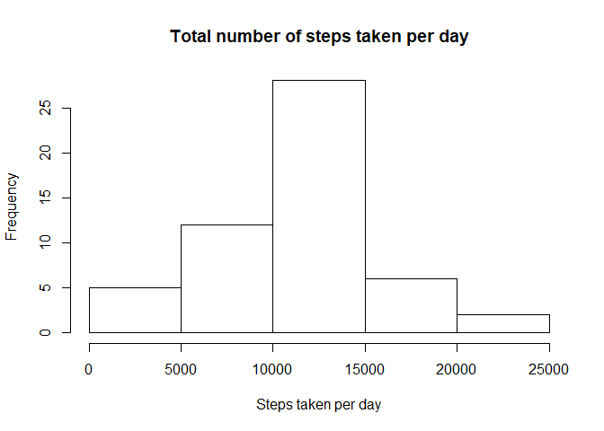
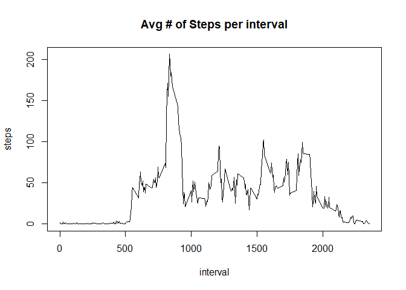
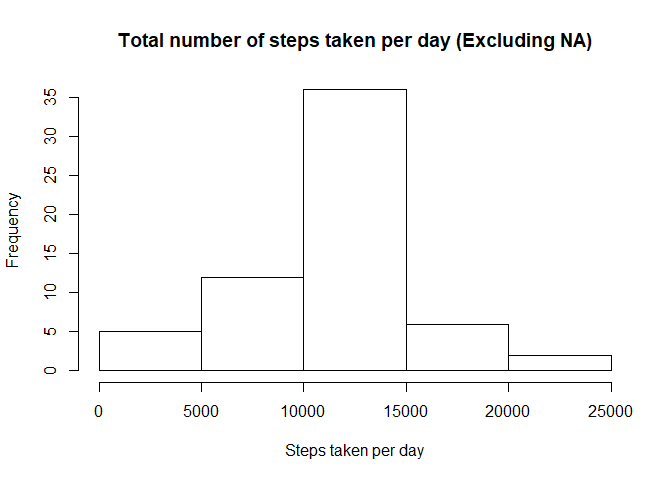

## Loading and preprocessing the data

```r
unzip("./activity.zip")
activityData <- read.csv("./activity.csv")
summary(activityData)
```

```
##      steps                date          interval     
##  Min.   :  0.00   2012-10-01:  288   Min.   :   0.0  
##  1st Qu.:  0.00   2012-10-02:  288   1st Qu.: 588.8  
##  Median :  0.00   2012-10-03:  288   Median :1177.5  
##  Mean   : 37.38   2012-10-04:  288   Mean   :1177.5  
##  3rd Qu.: 12.00   2012-10-05:  288   3rd Qu.:1766.2  
##  Max.   :806.00   2012-10-06:  288   Max.   :2355.0  
##  NA's   :2304     (Other)   :15840
```

```r
head(activityData)
```

```
##   steps       date interval
## 1    NA 2012-10-01        0
## 2    NA 2012-10-01        5
## 3    NA 2012-10-01       10
## 4    NA 2012-10-01       15
## 5    NA 2012-10-01       20
## 6    NA 2012-10-01       25
```

## What is mean total number of steps taken per day?

```r
StepsPerDay <- aggregate(steps ~ date, activityData, sum, na.rm=TRUE)
hist(StepsPerDay$steps, main = "Total number of steps taken per day",  xlab = "Steps taken per day")
```

<!-- -->

```r
meanStepsPerDay <- mean(StepsPerDay$steps)
medianStepsPerDay <- median(StepsPerDay$steps)
meanStepsPerDay
```

```
## [1] 10766.19
```

```r
medianStepsPerDay
```

```
## [1] 10765
```
## What is the average daily activity pattern?

```r
StepsPerInterval<-aggregate(steps~interval, data=activityData, mean, na.rm=TRUE)
plot(steps~interval, data=StepsPerInterval, type="l", main = "Avg # of Steps per interval")
```

<!-- -->

```r
IntervalWithMaxStep = StepsPerInterval[which.max(StepsPerInterval$steps),]$interval
IntervalWithMaxStep
```

```
## [1] 835
```
## Imputing missing values

```r
totalNAValues <- sum(is.na(activityData$steps))
totalNAValues
```

```
## [1] 2304
```

```r
getMeanStepsPerInterval<-function(interval){
    StepsPerInterval[StepsPerInterval$interval==interval,]$steps
}

activityDataExcludingNA<-activityData
for(i in 1:nrow(activityDataExcludingNA)){
    if(is.na(activityDataExcludingNA[i,]$steps)){
        activityDataExcludingNA[i,]$steps <- getMeanStepsPerInterval(activityDataExcludingNA[i,]$interval)
    }
}

totalStepsPerDayExcludingNA <- aggregate(steps ~ date, data=activityDataExcludingNA, sum)
hist(totalStepsPerDayExcludingNA$steps,  main = "Total number of steps taken per day (Excluding NA)",  xlab = "Steps taken per day")
```

<!-- -->
## Are there differences in activity patterns between weekdays and weekends?

```r
activityDataExcludingNA$date <- as.Date(strptime(activityDataExcludingNA$date, format="%Y-%m-%d"))
activityDataExcludingNA$day <- weekdays(activityDataExcludingNA$date)
for (i in 1:nrow(activityDataExcludingNA)) {
    if (activityDataExcludingNA[i,]$day %in% c("Saturday","Sunday")) {
        activityDataExcludingNA[i,]$day<-"weekend"
    }
    else{
        activityDataExcludingNA[i,]$day<-"weekday"
    }
}
stepsByDay <- aggregate(activityDataExcludingNA$steps ~ activityDataExcludingNA$interval + activityDataExcludingNA$day, activityDataExcludingNA, mean)

names(stepsByDay) <- c("interval", "day", "steps")
library(lattice)
xyplot(steps ~ interval | day, stepsByDay, type = "l", layout = c(1, 2), 
    xlab = "Interval", ylab = "Number of steps")
```

<!-- -->
